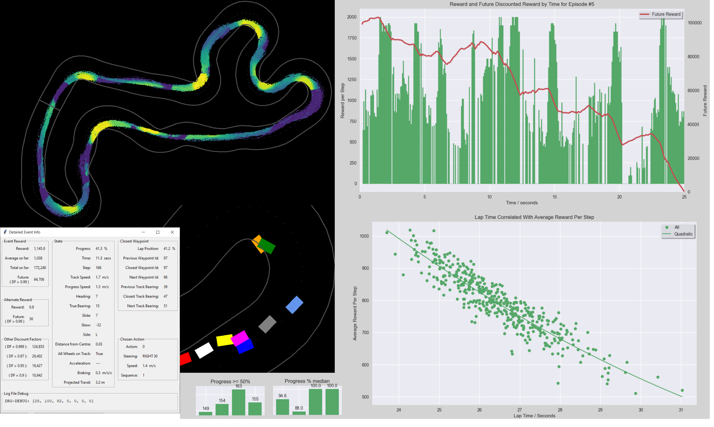

# deep_racer_guru

## Announcement
4th August 2021: Version 3.2.1 is now available with support for the latest monthly competition tracks

## Introduction

Deep Racer Guru (DRG) is an interactive detailed analysis tool for AWS Deep Racer logs.

Its main purpose is to provide "out-of-the-box" analysis that can run locally on your own computer.

You don't have to write Python code. Simply download logs from the AWS Deep Racer console, and then use a GUI to see how your models are performing.

## Want to See More?

Look at the new [Gallery](docs/gallery.md)

## Want to Start Using It?

Read the [Installation Instructions](docs/installation.md) and [Getting Started Guide](docs/getting_started.md)

## Want to Write Reward Functions More Easily?

See its sibling product [Deep Racer Framework](https://github.com/dmh23/deep_racer_framework) (DRF)

## Additional Documentation

* [Terminology](docs/terminology.md)
* [Special Mouse and Keyboard Actions](docs/mouse_and_keyboard.md)
* [Special Topics](docs/special_topics.md)
* [Troubleshooting](docs/trouble_shooting.md)

## Old Announcements
* 4th July 2021: Version 3.2.0 is available with new features including the latest competition tracks, support for continuous action space, episode filtering options for object avoidance, click-thru' from a scatter graph blob to see the episode route details and improved documentation including an extended gallery to showcase what's possible
* 20th May 2021: Version 3.1.0 has now arrived, adding the new "track fitting" feature and fixing various bugs including the fatal defect in version 3.0.1
* 20th May 2021: Version 3.0.1 has been withdrawn due to a fatal defect
* 24th April 2021: Version 3.0.0 has now arrived, with many new features and fixes

