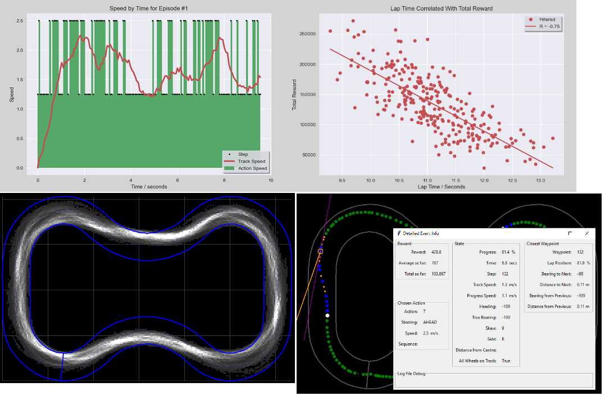
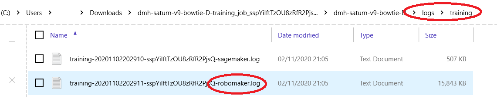
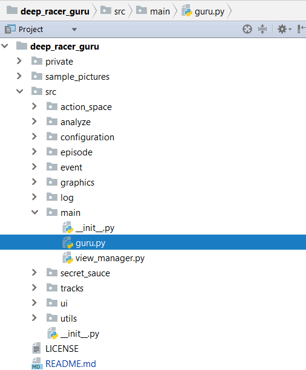

# deep_racer_guru

## Introduction

Deep Racer Guru (DRG) is an interactive detailed analysis tool for AWS Deep Racer logs.

Its main purpose is to provide "out-of-the-box" analysis that can run locally on your own computer.

You don't have to write Python code. Simply download logs from the AWS Deep Racer console, and then use a GUI to see how your models are performing.

## Installation Notes

DRG is written entirely in Python 3. It "should" work with any recent 3.x.x version of Python (I currently use version 3.8.3)

You will also need to install the following standard libraries using "pip":
* tkinter
* math
* pickle
* json
* os
* numpy
* matplotlib
* scipy

### Upgrade Instructions From Old Versions

If upgrading from **1.2.0** or **1.2.1**
* Edit src/configuration/personal_configuration.py which will be overwritten when you download the new version (see "Configure DRG", below)

If upgrading from **1.1.0**
* The list of required libraries has changed, see "Installation Notes" above
* Edit src/configuration/personal_configuration.py which will be overwritten when you download the new version (see "Configure DRG", below)

If upgrading from **1.0.0**
* The list of required libraries has changed, see "Installation Notes" above
* Edit src/configuration/personal_configuration.py which will be overwritten when you download the new version (see "Configure DRG", below)
* Run DRG, and go to the Admin menu and choose "Re-calculate Log Meta"

## Getting Started

### Download Logs
You'll first need to download some log files as follows:
* Go to the DeepRacer console and view the training info for a model
* Click the "**Download logs**" button at the top of the training section 
* Open the zip archive and locate the **robomaker** log file in the **logs/training** folder

* Extract/save it locally
* If you wish, repeat this process to download log file(s) for other model(s) too

### Configure DRG
Tell DRG where you have saved your log files by editing:
* src/configuration/personal_configuration.py

### Run DRG
Run the main DRG application class from here:
* src/main/guru.py

### Import Log Files
You must "Import" new log files before you can open them for analysis:
* In the Deep Racer Guru application, go to the **File -> New** menu option
* It will display a list of the new files, if it is correct then click OK to import them into DRG

### Open Log Files
* Use the Track menu to select the correct track
* Now go to the **File -> Open** menu to choose from log files you have downloaded for that selected track

