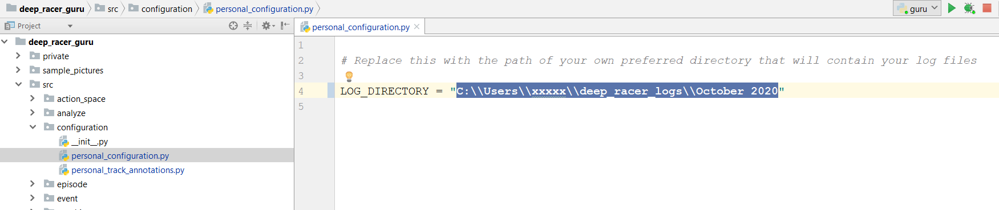

# Getting Started

## Download Logs
You'll first need to download some log files as follows:
* Go to the DeepRacer console and view the training info for a model
* Click the "**Download logs**" button at the top of the training section 
* Open the zip archive and locate the **robomaker** log file in the **logs/training** folder

* Extract/save it locally
* If you wish, repeat this process to download log file(s) for other model(s) too

## Run DRG
Run the main DRG application class from here:
* src/main/guru.py

## Configure DRG
Tell DRG where you have saved your log files by:
* TODO

## Import Log Files
You must "Import" new log files before you can open them for analysis:
* In the Deep Racer Guru application, go to the **File -> New** menu option
* It will display a list of the new files, if it is correct then click OK to import them into DRG

### Open Log Files
* Use the Track menu to select the correct track
* Now go to the **File -> Open** menu to choose from log files you have downloaded for that selected track

