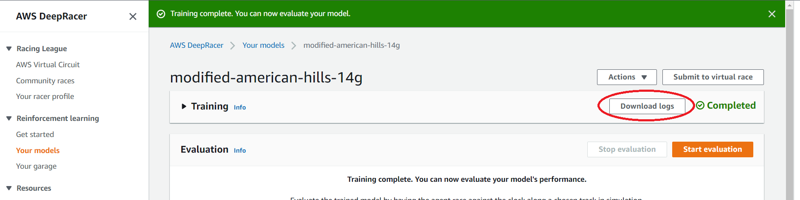

# Getting Started

## Download Logs

DRG works with logs from either the AWS DeepRacer console, or your own indepedent training if you have moved away from the offical console.

You just need to make sure you extract the correct **robomaker** log file and then you can store it wherever you want to organize your log files.

You will probably want to store related log files in the same directory/folder so you can manage and compare them most easily using DRG.

### Download Logs from AWS Console

Download a log file as follows:
* Go to the AWS DeepRacer console and view the training details for a model
* Click the "**Download logs**" button at the top of the training section (note - this button is only enabled once training has completed)

* After it has downloaded, open the zip archive and locate the **robomaker** log file in the **logs/training** folder

* Extract/save it locally
* If you wish, repeat this process to download log file(s) for other model(s) too

### Download Logs from Other Sources

Simply transfer or copy **robomaker** log files into a directory/folder that DRG can access.

Make sure you have obtainded the correct log file which should mostly contain log entries like this:
    SIM_TRACE_LOG:0,1,-2.2896,-4.6243,2.7800,0.00,3.80,7,0.0000,False,True,0.1577,0,89.24,35.413,prepare,0.00
    SIM_TRACE_LOG:0,2,-2.2896,-4.6243,2.7823,-2.50,2.50,6,0.1577,False,True,0.1577,0,89.24,35.462,in_progress,0.00
    SIM_TRACE_LOG:0,3,-2.2885,-4.6243,2.7954,-2.50,2.50,6,0.0012,False,True,0.1588,0,89.24,35.526,in_progress,0.00
    SIM_TRACE_LOG:0,4,-2.2817,-4.6236,2.9279,-25.00,0.80,1,0.0077,False,True,0.1665,0,89.24,35.583,in_progress,0.00
    SIM_TRACE_LOG:0,5,-2.2586,-4.6262,1.9827,-10.00,1.80,4,0.0258,False,True,0.1922,1,89.24,35.63,in_progress,0.00
    SIM_TRACE_LOG:0,6,-2.2342,-4.6286,1.1980,-2.50,2.50,6,0.0271,False,True,0.2194,1,89.24,35.703,in_progress,0.00

Also make sure you do NOT delete the information at the start of the log, since this contains information about the hyperparameters, track, action space and so on - which are essential for DRG.

## Run DRG
Run the main DRG application ... cross reference installation instructions TODO ...

## Configure DRG
Tell DRG where you have saved your log files by:
* TODO   file -> change directory

## Import Log Files
You must "Import" new log files before you can open them for analysis:
* In the Deep Racer Guru application, go to the **File -> New** menu option
* It will display a list of the new files, if it is correct then click OK to import them into DRG

### Open Log Files
* Use the Track menu to select the correct track
* Hint: tracks with log files are at the top of the list, above the divider
* Now go to the **File -> Open** menu to choose from log files you have downloaded for that selected track

