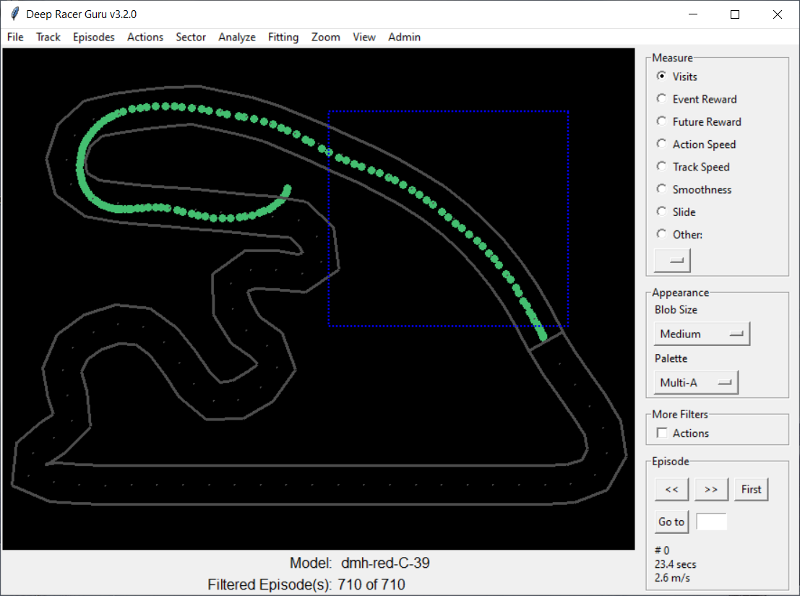
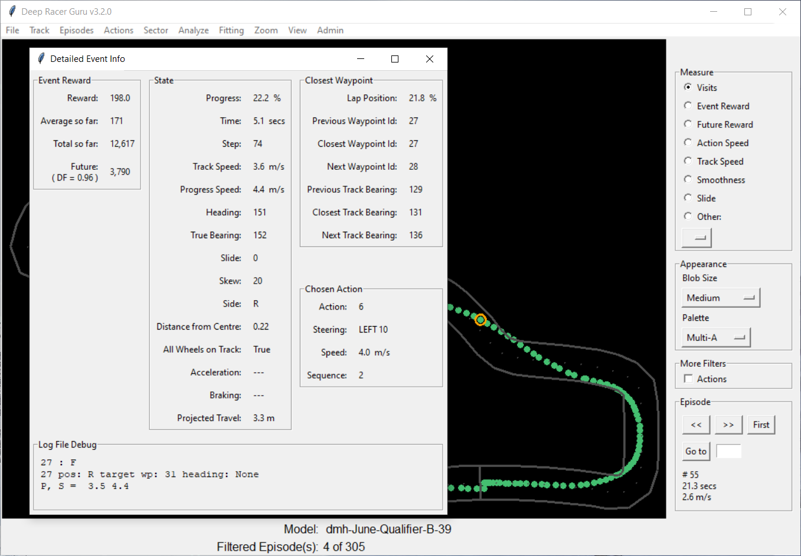
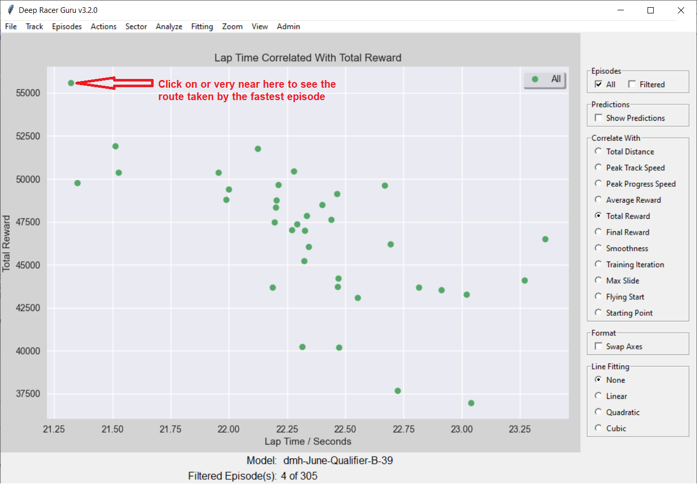
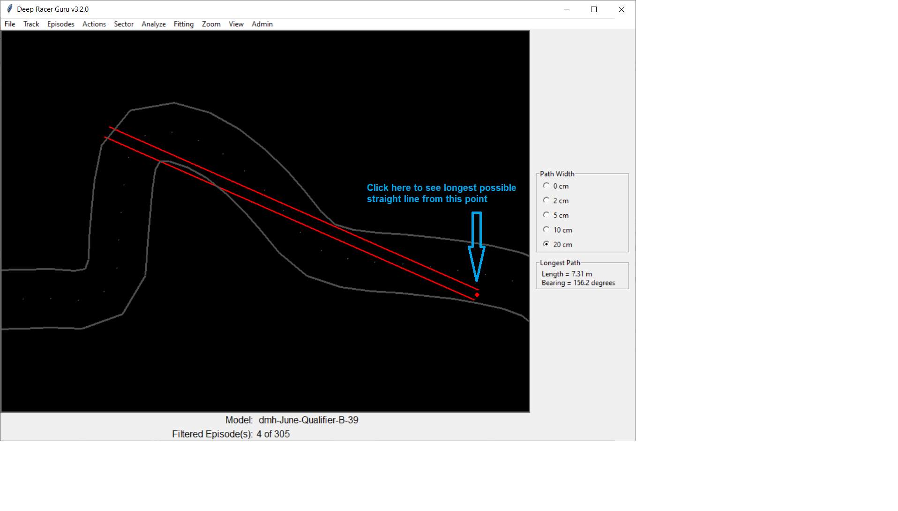
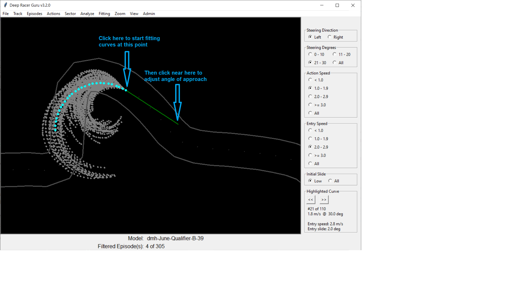
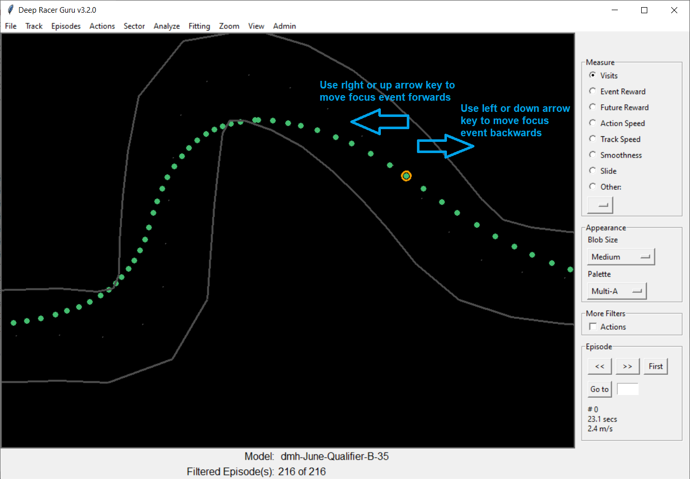

# Mouse and Keyboard Actions

## Zoom In

### Instructions

Whenever DRG is showing the track, whatever the analysis mode, click and hold the left mouse button and drag a rectangle where you wish to zoom in.

_Hint: To zoom back out to the complete track, especially if you get "lost" by zooming in too much, click on the menu option Zoom -> Zoom - In/Out_

_Note: Zooming is **not** currently supported for charts_

### Screenshot

## Detailed Info

### Instructions

Many (but not all) DRG analysis modes offer a "Detailed Info" interaction using either of the following, whichever you find most convenient:
* Right mouse button single click
* Left mouse button double click

The exact meaning is as follows:
* Analyze -> Episode Route ... display the "Detailed Event Info" window for the event/step nearest the mouse click(s)
* Any scatter chart ... switch to the Episode Route analysis for the blob nearest the mouse click(s)
* Any analysis from the "Fitting" menu ... the fitting starts at the mouse click(s) ... and for curve fitting, additional mouse click(s) can be used to finely adjust the angle of approach (see screenshot below)

_Hint: The "Detailed Event Info" window is a very powerful and useful feature of the Episode Route analysis; it gives you so much information about that single step_

_Hint: Using the "Lap Time Correlations" or "Sector Time Correlations", you will often identify an interesting episode; being able to then goto the full details of that episode in the "Episode Route" can save you a LOT of time in trying to understand the behaviour of your model or any training problems you face_

_Hint: When performing track curve fitting, click near the rear end of the straight approach line to move it around, thus changing the angle of approach to whatever you wish_

### Screenshots

Analyze -> Episode Route:

Any scatter chart e.g. Analyze -> Lap Time Correlations

Fitting -> Track Straight Fitting:

Fitting -> Track Curve Fitting:

## Next/Previous Event

### Instructions

Only during "Episode Route", once an event has been selected and displayed in the "Detailed Event Info" window, use the keyboard arrows keys to rapidly move to the previous or next event.

* Previous Event = Left or Down arrow key 
* Next Event = Right or Up arrow key

_Hint: hold down one of these keys to rapidly move forwards or backwards through multiple steps_

### Screenshot

